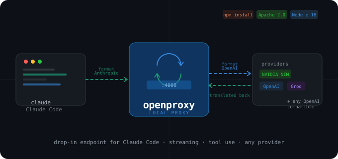

<p align="center">
  
</p>

# openproxy

> **Run Claude Code against any OpenAI-compatible provider.**
> Drop-in local proxy that translates the Anthropic Messages API into OpenAI chat completions — and back.

```
Claude Code  ──(Anthropic format)──▶  openproxy :4000
                                            │
                                            ▼  OpenAI format
                                      Provider API
                                  (NVIDIA NIM · Groq · OpenAI · …)
                                            │
                                            ▼  translated back
                                        Claude Code  ✅
```

Full support for **streaming (SSE)** and **tool use**. Works with any provider that speaks the OpenAI chat-completions API.

---

## Install

```bash
npm install -g openai-proxy
```

Installs the global `openproxy` command. Requires **Node.js ≥ 18**.

---

## Supported providers

| Provider | API base | Notes |
|----------|----------|-------|
| [NVIDIA NIM](https://build.nvidia.com) | `https://integrate.api.nvidia.com/v1` | Free tier — large models (Qwen, Llama, …) |
| [Groq](https://console.groq.com) | `https://api.groq.com/openai/v1` | Free tier — blazing fast inference |
| [OpenAI](https://platform.openai.com) | `https://api.openai.com/v1` | Paid |

Any provider with an OpenAI-compatible `/chat/completions` endpoint works.

---

## Quick start

### Option A — Browser wizard (recommended)

```bash
openproxy test
```

Opens `http://127.0.0.1:4000/test` in your browser. Fill in **API Key**, **API Base URL** and **Model**, hit **Save configuration**. Done. Next time, just:

```bash
openproxy start
```

### Option B — CLI

```bash
openproxy config \
  --api-key   nvapi-XXXXXXXXXX \
  --api-base  https://integrate.api.nvidia.com/v1 \
  --model     qwen/qwen3-coder-480b-a35b-instruct
```

---

## Use with Claude Code

```bash
export ANTHROPIC_BASE_URL="http://localhost:4000"
export ANTHROPIC_API_KEY="fake-key"   # any string — the proxy uses its own key
claude
```

To persist these across shell sessions:

```bash
echo 'export ANTHROPIC_BASE_URL="http://localhost:4000"' >> ~/.zshrc
echo 'export ANTHROPIC_API_KEY="fake-key"'               >> ~/.zshrc
source ~/.zshrc
```

---

## Daily usage

```bash
openproxy start          # start in the background
openproxy status         # check if running
openproxy stop           # stop the background process
openproxy logs -f        # follow live logs
openproxy test           # open browser tester / config UI
```

**On-the-fly overrides:**

```bash
openproxy start --port 5000 --model another-model
```

**Debug mode (attached to shell):**

```bash
openproxy start --foreground
```

---

## Browser tester

After `openproxy start`:

```bash
openproxy test
```

Opens `http://localhost:4000/test`. From here you can:

- Send test requests and inspect parsed responses
- Toggle streaming (SSE) on/off
- Copy the equivalent `curl` command

---

## All commands & options

```
openproxy start [options]    Start the proxy in the background
openproxy stop               Stop the proxy
openproxy status             Show running state
openproxy test               Open the browser-based tester
openproxy logs [-f]          Print proxy logs (-f to follow)
openproxy config [options]   Persist config to ~/.openproxy/config.json
openproxy help               Show usage
```

| Flag | Applies to | Default |
|------|-----------|---------|
| `--api-key <key>` | start, config | — |
| `--api-base <url>` | start, config | `https://integrate.api.nvidia.com/v1` |
| `--model <name>` | start, config | — |
| `--port <n>` | start, config | `4000` |
| `--timeout <s>` | start, config | `300` |
| `--foreground` | start only | — |
| `--clear` | config only | — |

---

## Configuration precedence

For every setting, the first source that has a value wins:

1. CLI flag (`--api-key`, `--model`, …)
2. Environment variable (`API_KEY`, `MODEL`, `API_BASE`, `PORT`, `REQUEST_TIMEOUT`)
3. `~/.openproxy/config.json`
4. Built-in default (only for `api-base`, `port`, `timeout`)

> The proxy starts even without `API_KEY` / `MODEL`, but `/v1/messages` returns **503** until both are configured.

### Shell env vars vs. saved config

If you export `API_KEY` / `MODEL` / `API_BASE` in your shell, **those take priority over `~/.openproxy/config.json`** on every start.

The browser config page makes this transparent:

- Each field shows a source badge: `saved` (green) or `from env var` (yellow)
- A yellow banner lists every env var that will override on the next restart, with the exact `unset` command

To make saved config authoritative, `unset` the conflicting shell vars and restart.

---

## Files

| Path | Purpose |
|------|---------|
| `~/.openproxy/config.json` | Persisted config (`chmod 600` on POSIX) |
| `~/.openproxy/proxy.pid` | Background process PID |
| `~/.openproxy/proxy.log` | Combined stdout/stderr |

The proxy binds to `127.0.0.1` only — the config endpoint is never reachable from the network.

---

## Troubleshooting

| Symptom | Cause | Fix |
|---------|-------|-----|
| `503 Proxy not configured` | API key or model not set | `openproxy test` or `openproxy config --api-key K --model M` |
| `Proxy already running` | Previous instance still alive | `openproxy stop` |
| `401 Unauthorized` from upstream | Wrong API key | `openproxy config --api-key <correct-key>` |
| `404 Not Found` from upstream | Wrong model name | Check the exact slug on the provider's dashboard |
| `Upstream timeout` | Slow provider response | `openproxy start --timeout 600` |
| Saved values lost after restart | Shell env vars override the file | `unset API_KEY MODEL` then restart |
| Claude Code: `model not found` | Missing client env vars | Re-export `ANTHROPIC_BASE_URL` and `ANTHROPIC_API_KEY` |

---

## License

[Apache 2.0](https://www.apache.org/licenses/LICENSE-2.0)

---

powered with ❤️ from **ermaaga** · 🤖